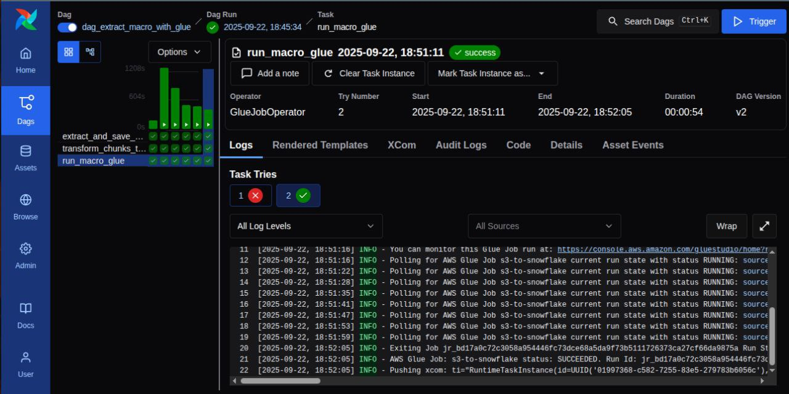

# PDF Chunk y Embedding

## 🇪🇸 Descripción (Español)

Este proyecto es un ETL completo de procesamiento de PDFs que genera **chunks → S3 → embeddings → S3 → Glue/Python Shell → carga en base de datos vectorial de Snowflake**.

Se encarga de todo el flujo de extracción, transformación y carga, asegurando que no se procesen PDFs duplicados gracias a Redis.
---

## 🚀 Componentes principales

1. **Infraestructura (Terraform)**
   - Snowflake
     - base de datos vectorial de 768 dimenciones
     - schema
     - tablas
     - Warehouse
   - Crea en AWS:
     - Buckets de **S3** para el data lake.
     - **Glue job** para migración a Snowflake.
     - Roles y políticas de **IAM**.

2. **Orquestación de ETLs (Airflow)**
   - Pipelines que:
     - **Descargan los PDFs** desde las URLs definidas en [`urls.txt`](dags/urls.txt) usando la librería [`macro-flow`](https://pypi.org/project/macro-flow/).  
     - **Transforman en chunks** los PDFs en formato Parquet para reducir tamaño y facilitar procesamiento.
     - **Generan embeddings** usando la librería [`macro-embedding-flow`](https://pypi.org/project/macro-embedding-flow), con vectores de 768 dimensiones.
     - **Cargan** los resultados en **S3** y luego mediante Glue/Python Shell a **Snowflake**.
     - **Redis** asegura que no haya idempotencia y PDFs duplicados.

---

## 🛠️ Tecnologías

- Apache Airflow  
- Terraform  
- AWS (S3, Redshift, Glue, Secrets Manager)  
- Docker & Docker Compose  
- Python jobs  
- Ansible  
- Redis    
- Librerías personalizadas: [`macro-flow`](https://pypi.org/project/macro-flow/), [`macro-embedding-flow`](https://pypi.org/project/macro-embedding-flow/)

---

## 📂 Estructura del proyecto

```bash
├── ansible/              # Playbooks y roles de Ansible
├── dags/                 # DAGs y configuración de Airflow
├── infra/                # Infraestructura como código (Terraform)
├── docker-compose.yml    # Orquestación local con Docker Compose
├── example.env           # .env de ejemplo con credenciales
├── requirements.txt      # Dependencias del proyecto
└── README.md             # Documentación principal
```

```bash
git clone https://github.com/facuvgaa/chunk-embedding-aws-snowflake.git
cd chunk-embedding-aws-snowflake
```

2. Configuración de example.env

Editar example.env para agregar credenciales de AWS y Snowflake, y personalizar nombres de S3, Glue, IAM, etc.

```bash
# AWS credenciales
AWS_ACCESS_KEY_ID=your_access_key
AWS_SECRET_ACCESS_KEY=your_secret_key
AWS_DEFAULT_REGION=us-east-1

# Snowflake credenciales
SNOWFLAKE_USER=
SNOWFLAKE_ACCOUNT=
SNOWFLAKE_PASSWORD=
SNOWFLAKE_TOKEN=
SNOWFLAKE_ORGANIZATION=LVNPGEI
SNOWFLAKE_DATABASE=macro_db
SNOWFLAKE_SCHEMA=EMBEDDINGS
SNOWFLAKE_WAREHOUSE=TEMP22_WH
SNOWFLAKE_ROLE=ACCOUNTADMIN
SNOWFLAKE_EMBED_TEMP=EMBED_TEMP

```

3. Levantar infraestructura con Terraform (vía Docker + Make)


```bash
cd infra/

# Levantar Docker con Terraform
make build

# Inicializar Terraform
make terraform-init

# Validar configuración
make terraform-validate

# Aplicar cambios y crear infraestructura en AWS
make terraform-apply

cd ..

```

4. Levantar servicios de Airflow
```bash
airflow-password
```

5. Inyectar dependencias con Ansible
```bash
airflow-inyeccion
```

6. Obtener contraseña de Airflow
```bash
airflow-inyeccion
```

7. Acceder a la interfaz web de Airflow

* URL: http://localhost:8080

* Usuario: admin

* Contraseña: la que obtuviste con el comando anterior

## 8. 📝 Notas finales

- 🖥️ Proyecto pensado para **pruebas locales** y despliegue en **AWS**.
- 🐍 Recomendado **Python 3.12**.
- 📦 Mantener librerías actualizadas:

9. Airflow

Este proyecto muestra un pipeline completo orquestado con Airflow, chunkeo y embedding hasta db vectorial:

**Airflow** : 


## 📄 Licencia

Este proyecto está bajo la Licencia MIT - ver el archivo [LICENSE](LICENSE) para detalles.


# PDF Chunking and Embedding

## 🇬🇧 Description (English)

This project is a complete PDF processing ETL that generates **chunks → S3 → embeddings → S3 → Glue/Python Shell → loading into a Snowflake vector database**.

It handles the entire extraction, transformation, and load (ETL) flow, ensuring that duplicate PDFs are not processed thanks to Redis.
---

## 🚀 Main Components

1.  **Infrastructure (Terraform)**
    * Snowflake
        * 768-dimension vector database
        * schema
        * tables
        * Warehouse
    * Creates in AWS:
        * **S3** buckets for the data lake.
        * **Glue job** for migration to Snowflake.
        * **IAM** roles and policies.

2.  **ETL Orchestration (Airflow)**
    * Pipelines that:
        * **Download PDFs** from the URLs defined in [`urls.txt`](dags/urls.txt) using the [`macro-flow`](https://pypi.org/project/macro-flow/) library.
        * **Transform PDFs into chunks** in Parquet format to reduce size and facilitate processing.
        * **Generate embeddings** using the [`macro-embedding-flow`](https://pypi.org/project/macro-embedding-flow/) library, with 768-dimension vectors.
        * **Load** the results into **S3** and then via Glue/Python Shell to **Snowflake**.
        * **Redis** ensures idempotency and prevents duplicate PDFs.

---

## 🛠️ Technologies

-   Apache Airflow
-   Terraform
-   AWS (S3, Redshift, Glue, Secrets Manager)
-   Docker & Docker Compose
-   Python jobs
-   Ansible
-   Redis
-   Custom libraries: [`macro-flow`](https://pypi.org/project/macro-flow/), [`macro-embedding-flow`](https://pypi.org/project/macro-embedding-flow/)

---

## 📂 Project Structure

```bash
├── ansible/              # Ansible playbooks and roles
├── dags/                 # Airflow DAGs and configuration
├── infra/                # Infrastructure as Code (Terraform)
├── docker-compose.yml    # Local orchestration with Docker Compose
├── example.env           # Example .env with credentials
├── requirements.txt      # Project dependencies
└── README.md             # Main documentation
```

```bash
git clone [https://github.com/facuvgaa/chunk-embedding-aws-snowflake.git](https://github.com/facuvgaa/chunk-embedding-aws-snowflake.git)
cd chunk-embedding-aws-snowflake
```

2. Configure example.env

Edit example.env to add your AWS and Snowflake credentials, and customize S3, Glue, IAM names, etc.

```bash
# AWS credentials
AWS_ACCESS_KEY_ID=your_access_key
AWS_SECRET_ACCESS_KEY=your_secret_key
AWS_DEFAULT_REGION=us-east-1

# Snowflake credentials
SNOWFLAKE_USER=
SNOWFLAKE_ACCOUNT=
SNOWFLAKE_PASSWORD=
SNOWFLAKE_TOKEN=
SNOWFLAKE_ORGANIZATION=LVNPGEI
SNOWFLAKE_DATABASE=macro_db
SNOWFLAKE_SCHEMA=EMBEDDINGS
SNOWFLAKE_WAREHOUSE=TEMP22_WH
SNOWFLAKE_ROLE=ACCOUNTADMIN
SNOWFLAKE_EMBED_TEMP=EMBED_TEMP
```

3. Spin up infrastructure with Terraform (via Docker + Make)

```bash
cd infra/

# Build the Docker container with Terraform
make build

# Initialize Terraform
make terraform-init

# Validate configuration
make terraform-validate

# Apply changes and create infrastructure in AWS
make terraform-apply

cd ..
```

4. Start Airflow services
```bash
airflow-password
```

5. Inject dependencies with Ansible
```bash
airflow-inyeccion
```

6. Get Airflow password
```bash
airflow-password
```
7. Access the Airflow web interface

* URL: http://localhost:8080

* User: admin

* Password: the one you obtained with the previous    command


8. 📝 Final Notes
* 🖥️ Project designed for local testing and deployment on AWS.

* 🐍 Python 3.12 is recommended.

* 📦 Keep libraries updated:

9. Airflow

This project shows a complete pipeline orchestrated with Airflow, from chunking and embedding to the vector DB:

**Airflow** : 

📄 License
This project is under the MIT License - see the LICENSE file for details.